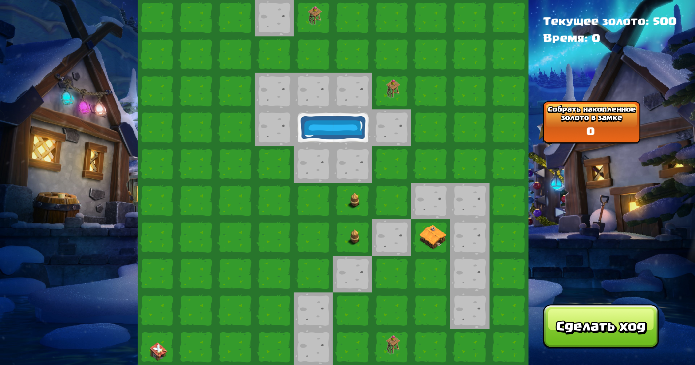
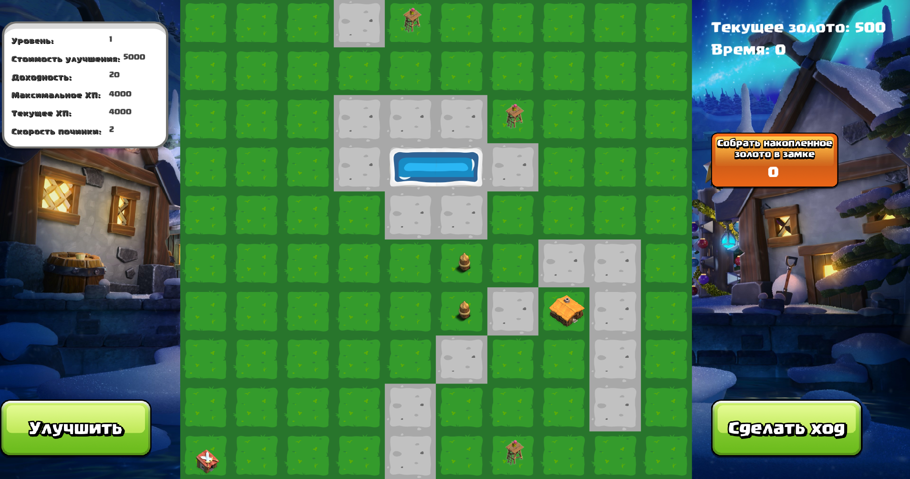
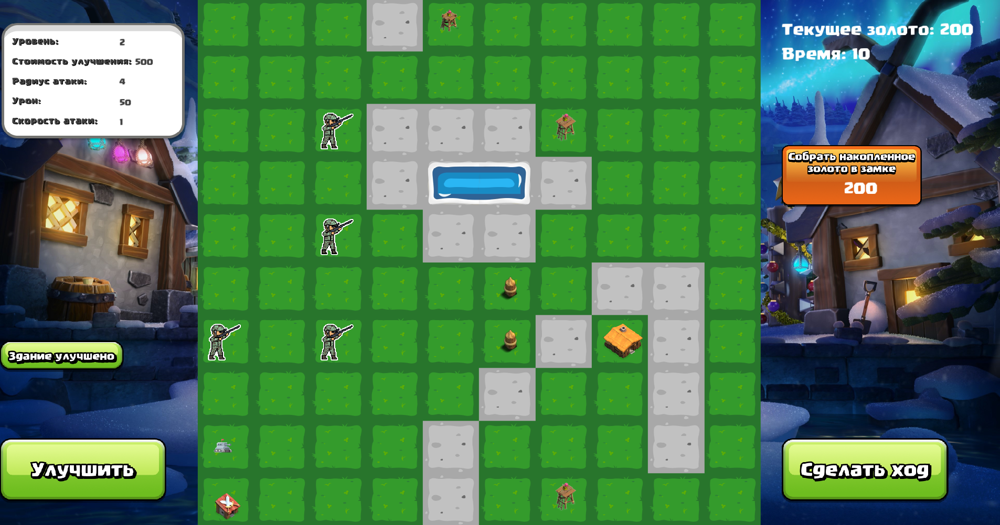

# tower-defence
[](https://isocpp.org/)
## 📑 Содержание

- [Описание](#-описание)
- [Сетап](#-сетап)
- [Сборка проекта](#-сборка-проекта)
- [Возможности игры](#-возможности-игры)
- [Документация](#-документация)

## 📖 Описание
- Данный проект представляет собой реализацию игры поджанра `Tower Defence`. Игровой процесс происходит на местности, покрытой водоёмами, горами и равнинами. Враги, порождаемые расположенными на карте логовами, пытаются добраться до замка игрока. Если врагу удастся дойти до замка, они наносят ему урон, вычисляемый как количество оставшегося здоровья умноженный на коэффициент урона, после чего погибает. Цель врагов - уничтожить замок, цель игрока - не позволить им это сделать. 
- Для защиты замка игрок может установить на равнинах следующие виды построек: защитные башни и стены. Стены просто блокируют проход для врагов, но могут быть разрушены. Башни автоматически открывают огонь по врагам, если они попали в радиус её действия. Кроме того, они не могут быть разрушены. На установку построек тратится золото, которое периодический приносится в казну замком.
- Все необходимые конфигурационные файлы в формате `.csv` находятся в следующей директории: [./tests/configs](./tests/configs/).

В проекте применяются принципы `SOLID`, а также паттерны проектирования, такие как, например, `Factory`, что обеспечивает гибкость и расширяемость архитектуры.

## ⚙️ Сетап
- Компилятор с поддержкой `C++20` или выше
- Для сборки используется `CMake`
- Для многопоточности используется библиотека `TBB`
- Для GUI используется библиотека `SFML`
- Для проверки покрытия кода тестами используется `GCov`


## 🛠️ Сборка проекта

### Стандартная сборка (без тестов)
```bash
cmake -B build -DGUI=ON
cmake --build build
```

### Сборка с тестами
```bash
cmake -B build -DBUILD_TESTING=ON
cmake --build build
```

### Запуск тестов:
```bash
./build/tests/all_tests
```

### Запуск игры:
```bash
./build/towerDefenceExecutable
```

## 🧩 Возможности игры
- Пошаговый режим игры - каждый ход активируется нажатием на кнопку `Сделать ход`.

- При нажатии на постройку или врага слева отображается подробная **статистика** объекта:
  - Для врагов: тип, здоровье, скорость и прочее.
  - Для построек: уровень, урон, радиус атаки и т.д.


- В замке каждый ход **накапливается золото**, которое можно **собрать вручную** отдельной кнопкой.

- Игра заканчивается, если враги уничтожат замок.

## 📚 Документация

Подробное описание проекта можно найти в следующих документах:
- [general_task.pdf](./docs/general_task.pdf)
- [individual_task.pdf](./docs/individual_task.pdf)